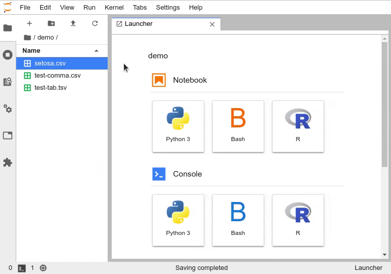
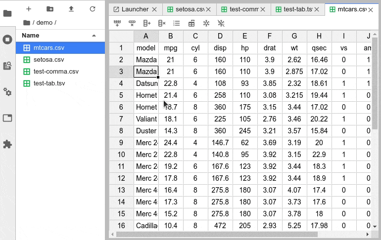
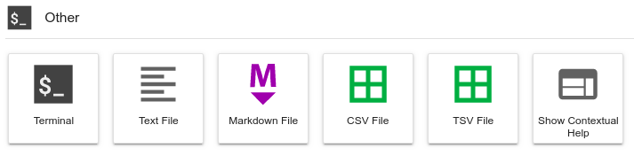

# JupyterLab Spreadsheet Editor


JupyterLab spreadsheet editor enables interactive editing of comma/tab separated value spreadsheets.
It support formulas, sorting, column/row rearrangements and more!

> Note: unless you need formula and/or column/row freeze support you probably want to use a newer extension: [tabular-data-editor](https://github.com/jupytercalpoly/jupyterlab-tabular-data-editor)

## Showcase

**Fully featured integration**

- row/column operations, column width adjustment
- search and replace



**Formula support**
basic formula calculation (rendering) - as implemented by jExcel.


**Column freezing**
for exploration of wide datasets with many covariates



**Launcher items**:
create CSV/TSV files easily from the launcher or the palette.



**Lightweight and reliable dependencies**:
the spreadsheet interface is built with the [jexcel](https://github.com/paulhodel/jexcel), while [Papa Parse](https://github.com/mholt/PapaParse) provides very fast, [RFC 4180](https://tools.ietf.org/html/rfc4180) compatible CSV parsing (both have no third-party dependencies).

## Requirements

- JupyterLab >= 3.0

## Install

```bash
pip install spreadsheet-editor
```

## Contributing

### Development install

Note: You will need NodeJS to build the extension package.

The `jlpm` command is JupyterLab's pinned version of
[yarn](https://yarnpkg.com/) that is installed with JupyterLab. You may use
`yarn` or `npm` in lieu of `jlpm` below.

```bash
# Clone the repo to your local environment
# Change directory to the spreadsheet-editor directory
# Install package in development mode
pip install -e .
# Link your development version of the extension with JupyterLab
jupyter labextension develop . --overwrite
# Rebuild extension Typescript source after making changes
jlpm run build
```

You can watch the source directory and run JupyterLab at the same time in different terminals to watch for changes in the extension's source and automatically rebuild the extension.

```bash
# Watch the source directory in one terminal, automatically rebuilding when needed
jlpm run watch
# Run JupyterLab in another terminal
jupyter lab
```

With the watch command running, every saved change will immediately be built locally and available in your running JupyterLab. Refresh JupyterLab to load the change in your browser (you may need to wait several seconds for the extension to be rebuilt).

By default, the `jlpm run build` command generates the source maps for this extension to make it easier to debug using the browser dev tools. To also generate source maps for the JupyterLab core extensions, you can run the following command:

```bash
jupyter lab build --minimize=False
```

### Uninstall

```bash
pip uninstall spreadsheet-editor
```

## Related extensions

Spreadsheet editors:

- [jupyterlab-tabular-data-editor](https://github.com/jupytercalpoly/jupyterlab-tabular-data-editor)

Spreadsheet viewers:

- [jupyterlab-spreadsheet](https://github.com/quigleyj97/jupyterlab-spreadsheet) implements Excel spreadsheet viewer
- the built-in [csvviewer](https://github.com/jupyterlab/jupyterlab/tree/master/packages/csvviewer) ([extension](https://github.com/jupyterlab/jupyterlab/tree/master/packages/csvviewer-extension)) allows to display CSV/TSV files
